# 🚀 Azure Infrastructure Reporter

Automated Azure infrastructure documentation generator with multi-project support. This tool fetches Azure resource specifications and generates professional Word documents for Infrastructure Acceptance Testing (IAT).

## 📊 Project Architecture

```mermaid
graph TB
    subgraph "📁 Project Structure"
        CONFIG["⚙️ config.ts<br/>Single Configuration File"]
        MAIN["🚀 main.ts<br/>Entry Point"]
        
        subgraph "📡 Data Fetchers"
            WEB["🌐 web-server.ts<br/>App Service + Plan"]
            DB["🗄️ database.ts<br/>SQL Database"]
            REDIS["⚡ redis.ts<br/>Redis Cache"]
            STORAGE["💾 storage.ts<br/>Storage Account"]
            ALERTS["🚨 alert.ts<br/>Monitor Alerts"]
            CUSTOM["➕ Custom Fetchers<br/>Any Resource"]
        end
        
        subgraph "📄 Document Generator"
            DOCGEN["📝 document-generator.ts<br/>Universal JSON → Word"]
        end
    end
    
    subgraph "☁️ Data Sources"
        AZURE["🔵 Azure APIs<br/>Resource Manager"]
        MANUAL["✏️ Manual Data<br/>JSON Files"]
        EXTERNAL["🌐 External APIs<br/>Third Party"]
        DATABASE["🗄️ Database<br/>SQL Queries"]
        CSV["📊 CSV/Excel<br/>Import Files"]
    end
    
    subgraph "📁 Output"
        JSON1["📄 web-server-data.json"]
        JSON2["📄 database-data.json"]
        JSON3["📄 redis-data.json"]
        JSON4["📄 storage-data.json"]
        JSON5["📄 alert-data.json"]
        JSONX["📄 custom-data.json"]
    end
    
    subgraph "📋 Generated Documents"
        WORD["📄 Infrastructure Report.docx<br/>Professional Word Document"]
        SECTIONS["📑 Sections:<br/>• Web Server Spec<br/>• Database Spec<br/>• Redis Spec<br/>• Storage Spec<br/>• Alert Config"]
    end
    
    %% Configuration Flow
    CONFIG --> MAIN
    CONFIG --> DOCGEN
    
    %% Data Collection Flow
    MAIN --> WEB
    MAIN --> DB
    MAIN --> REDIS
    MAIN --> STORAGE
    MAIN --> ALERTS
    
    %% Data Source Connections
    AZURE --> WEB
    AZURE --> DB
    AZURE --> REDIS
    AZURE --> STORAGE
    AZURE --> ALERTS
    
    MANUAL --> JSONX
    EXTERNAL --> JSONX
    DATABASE --> JSONX
    CSV --> JSONX
    
    %% JSON Generation
    WEB --> JSON1
    DB --> JSON2
    REDIS --> JSON3
    STORAGE --> JSON4
    ALERTS --> JSON5
    CUSTOM --> JSONX
    
    %% Document Generation
    JSON1 --> DOCGEN
    JSON2 --> DOCGEN
    JSON3 --> DOCGEN
    JSON4 --> DOCGEN
    JSON5 --> DOCGEN
    JSONX --> DOCGEN
    
    DOCGEN --> WORD
    WORD --> SECTIONS
    
    %% Styling
    classDef configStyle fill:#e1f5fe,stroke:#01579b,stroke-width:2px
    classDef fetcherStyle fill:#f3e5f5,stroke:#4a148c,stroke-width:2px
    classDef dataStyle fill:#e8f5e8,stroke:#1b5e20,stroke-width:2px
    classDef jsonStyle fill:#fff3e0,stroke:#e65100,stroke-width:2px
    classDef docStyle fill:#fce4ec,stroke:#880e4f,stroke-width:2px
    
    class CONFIG,MAIN configStyle
    class WEB,DB,REDIS,STORAGE,ALERTS,CUSTOM fetcherStyle
    class AZURE,MANUAL,EXTERNAL,DATABASE,CSV dataStyle
    class JSON1,JSON2,JSON3,JSON4,JSON5,JSONX jsonStyle
    class DOCGEN,WORD,SECTIONS docStyle
```



## 🔄 Data Flow

```mermaid
sequenceDiagram
    participant User
    participant Config as ⚙️ config.ts
    participant Main as 🚀 main.ts
    participant Fetchers as 📡 Data Fetchers
    participant Azure as ☁️ Azure APIs
    participant Output as 📁 output/
    participant DocGen as 📄 Document Generator
    participant Word as 📋 Word Document

    User->>Config: 1. Configure project settings
    User->>Main: 2. Run: npm start
    
    Main->>Config: 3. Load configuration
    Config-->>Main: 4. Project settings & resource names
    
    Main->>Fetchers: 5. Execute all data fetchers
    
    par Parallel Data Collection
        Fetchers->>Azure: 6a. Fetch Web Server details
        Fetchers->>Azure: 6b. Fetch Database details  
        Fetchers->>Azure: 6c. Fetch Redis details
        Fetchers->>Azure: 6d. Fetch Storage details
        Fetchers->>Azure: 6e. Fetch Alert details
    end
    
    Azure-->>Fetchers: 7. Return resource configurations
    Fetchers->>Output: 8. Save JSON files (standardized format)
    
    Main->>DocGen: 9. Generate document
    DocGen->>Output: 10. Read all JSON files
    DocGen->>DocGen: 11. Process & format data
    DocGen->>Word: 12. Create professional Word document
    
    Word-->>User: 13. Infrastructure report ready! 📄✨
```



## Features

- **Super Simple Setup**: Clone → Configure → Run!
- **Automatic Resource Naming**: Generate Azure resource names from a base name using common patterns
- **Multi-Environment Support**: Perfect for different clients with different Azure tenants
- **Professional Documentation**: Generate formatted Word documents with tables and specifications
- **Flexible Document Generation**: Choose between manual section configuration or auto-discovery
- **Independent Testing**: Test individual data fetchers without running the full project

## Quick Start

### Prerequisites

1. Node.js 16 or higher
2. Azure CLI installed and logged in, or service principal configured
3. Appropriate Azure permissions to read resources

### Installation

```bash
git clone <your-repo-url> client-project-name
cd client-project-name
npm install
```

### Configuration

**Step 1: Edit `config.ts` (Only file you need to change!)**

```typescript
export const CONFIG: ProjectConfig = {
    // Project Information
    projectName: 'Orbia Test Environment',
    clientName: 'Orbia',
    environment: 'test',
    
    // 🔧 MAIN SETTING: Change this and everything else auto-generates!
    baseResourceName: 'batchline-orbia-test',
    
    // Document Settings
    outputFilename: 'orbia_test_infrastructure_report.docx',
    
    // 📊 Choose document generation mode
    useAutoDiscovery: false, // true = include all JSON files, false = use manual list
    
    // 📋 Manual sections (only if useAutoDiscovery = false)
    documentSections: [
        { filename: 'web-server-data.json', title: 'Web Server Specification', sectionNumber: '2.2.1', enabled: true },
        { filename: 'database-data.json', title: 'SQL Azure Database Specification', sectionNumber: '2.2.2', enabled: true },
        { filename: 'redis-data.json', title: 'Redis Cache Specification', sectionNumber: '2.2.3', enabled: true },
        { filename: 'storage-data.json', title: 'Azure Storage Specification', sectionNumber: '2.2.4', enabled: true },
        { filename: 'alert-data.json', title: 'Performance Monitoring', sectionNumber: '2.2.6', enabled: true },
    ]
};
```

**Step 2: Set Azure Credentials**

Create `.env` file:
```bash
AZURE_SUBSCRIPTION_ID=your-subscription-id
AZURE_CLIENT_ID=your-client-id       # For service principal
AZURE_CLIENT_SECRET=your-secret       # For service principal  
AZURE_TENANT_ID=your-tenant-id        # For service principal
```

**Step 3: Run!**

```bash
npm start
```

## 🤖 Auto-Generated Resource Names

From your `baseResourceName: 'batchline-orbia-test'`, the system automatically creates:

```
✅ Resource Group: batchline-orbia-test
✅ Web App: batchline-orbia-test-legacy
✅ App Service Plan: batchline-orbia-test-legacy  
✅ SQL Server: batchline-orbia-test
✅ SQL Database: batchline-orbia-test-legacy
✅ Redis Cache: batchline-orbia-test
✅ Storage Account: batchlineorbiatest (hyphens removed)
```

## 📊 Document Generation Modes

### Manual Control (Recommended)
```typescript
useAutoDiscovery: false
```
- Use the `documentSections` array in config.ts
- Full control over sections, titles, and numbering
- Enable/disable specific sections
- Perfect for standardized reports

### Auto-Discovery
```typescript
useAutoDiscovery: true
```
- Automatically includes all `*-data.json` files in output/
- Great for development/testing
- Sections numbered automatically

## 🛠️ Available Commands

```bash
# Generate full report
npm start

# Show current configuration
npm run config

# Generate document only (skip Azure data fetch)
npm run doc-only

# Development mode with auto-restart
npm run dev

# Test individual data fetchers
npm run test:web-server
npm run test:database
npm run test:redis
npm run test:storage
npm run test:alerts
```

## 📋 Supported Azure Resources

- **🌐 Web Apps**: App Service configuration, runtime settings, security, autoscaling
- **🗄️ SQL Database**: Server and database specifications, performance tiers, encryption
- **⚡ Redis Cache**: Configuration, performance tier, networking, security
- **💾 Storage Account**: Account type, replication, access tiers, encryption
- **🚨 Monitoring**: Alerts and performance monitoring setup across all resources

## 🔧 For Developers

### Testing Individual Components
Each data fetcher can be tested independently:

```bash
# Test specific components
ts-node src/data-fetchers/web-server.ts
ts-node src/data-fetchers/database.ts
ts-node src/data-fetchers/redis.ts
ts-node src/data-fetchers/storage.ts
ts-node src/data-fetchers/alert.ts
```

### Adding New Resource Types
See [DATA-FETCHERS.md](./DATA-FETCHERS.md) for detailed information about:
- How data fetchers work
- Adding new Azure resources
- Modifying existing fetchers
- Testing and debugging

## 🚀 Workflow for Multiple Clients

```bash
# Main repository (template)
git clone <repo> azure-reporter-main

# Client 1
git clone azure-reporter-main client-orbia-test
cd client-orbia-test
# Edit config.ts for Orbia
# Edit .env for Orbia Azure tenant
npm start

# Client 2  
git clone azure-reporter-main client-acme-prod
cd client-acme-prod
# Edit config.ts for Acme
# Edit .env for Acme Azure tenant
npm start
```

## 📁 Project Structure

```
├── config.ts                    # 🎯 SINGLE CONFIG FILE
├── main.ts                      # Entry point
├── package.json
├── .env                         # Azure credentials
├── src/
│   ├── data-fetchers/          # Azure data fetchers
│   ├── doc-generators/         # Document generator
│   └── types.ts               # Type definitions
├── output/                     # Generated JSON files
├── *.docx                     # Generated Word document
└── DATA-FETCHERS.md           # Developer documentation
```

## 🚨 Troubleshooting

### Authentication Issues
- Ensure Azure CLI is logged in: `az login`
- Verify subscription: `az account show`
- Check environment variables in `.env`

### Missing Resources
- Verify resource names match Azure resources
- Check Azure permissions for the subscription
- Review resource group and resource naming
- Use individual testing: `ts-node src/data-fetchers/[component].ts`

### Document Generation Issues
- Ensure output directory has write permissions
- Check that data files exist in the output directory
- Verify Word document isn't open in another application

## 💡 Tips

### Resource Naming Patterns
The tool works best when your Azure resources follow these patterns:
- **Base name**: `company-environment` (e.g., `batchline-orbia-test`)
- **Web Apps**: `{base}-legacy` (e.g., `batchline-orbia-test-legacy`)
- **Storage**: Remove hyphens (e.g., `batchlineorbiatest`)

### Environment Detection
Some features (like alerts) automatically detect environment from resource names:
- Resources with `test` → Test environment
- Resources with `prod` → Production environment

## 🔄 Migration from Older Versions

If you have an older version:
1. Create new `config.ts` from the template above
2. Move your settings from old configuration files
3. Update your `.env` file
4. Test with `npm run config` to verify settings

## 📖 Documentation

- **[DATA-FETCHERS.md](./DATA-FETCHERS.md)** - Detailed developer guide for data fetchers
- **config.ts** - All configuration options and examples
- **Generated output/** - JSON data files for debugging

## 🤝 Contributing

1. Fork the repository
2. Create a feature branch
3. Test your changes with individual data fetchers
4. Submit a pull request

## 📄 License

MIT License - see LICENSE file for details.

---

**Keep it simple: Clone → Configure → Run!** 🎉